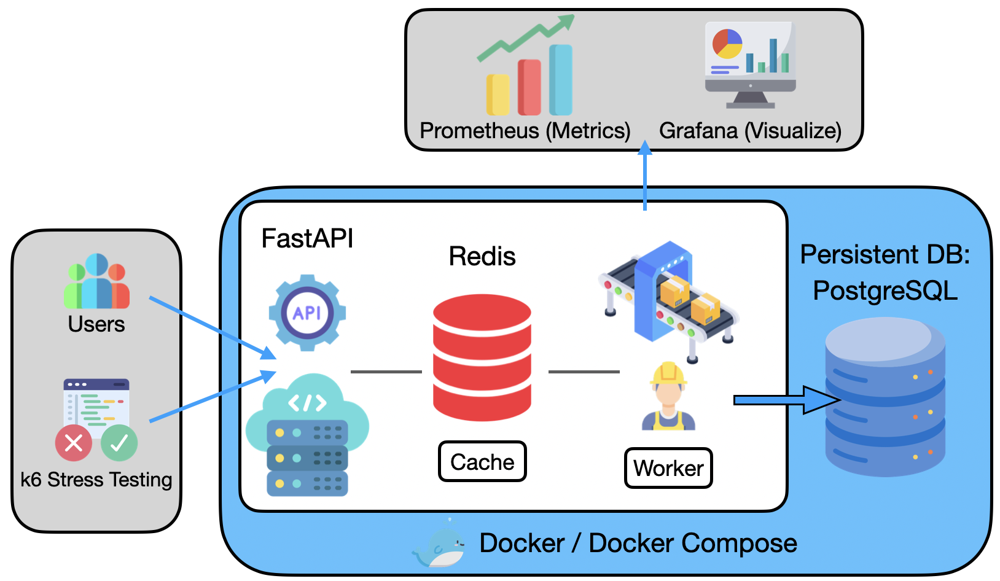

## High-Concurrency Ticketing System

一個用來**模擬高併發搶票系統**的專案，針對以下主題做改善：

- **高併發下不超賣**
- **API 與 DB 解耦的事件流架構**
- **完整 observability（監控 + 壓測）**

技術棧：**FastAPI + Redis + PostgreSQL + Prometheus + Grafana + k6 + GitHub Actions (CI/CD)**

## 系統架構圖



## 系統設計與技術亮點

- **Race Condition 解決方案（防止超賣）**
  - 使用 **Redis Lua Script** 實作原子化扣庫存
  - 所有搶票請求經過 Lua 腳本，確保**不會出現負庫存或重複賣票**

- **非同步持久化（提升吞吐量）**
  - API 收到成功搶票請求後，只負責把訂單寫入 Redis `order_queue`
  - **背景 worker** 從 queue 取出訂單，再寫入 PostgreSQL
  - 達成 **「前台快回應，後台慢慢寫 DB」** 的解耦設計

- **監控與可觀測性 (Observability)**
  - 透過 `prometheus_fastapi_instrumentator` 自動導出 FastAPI 指標
  - Prometheus 抓取指標，Grafana 可視化 **RPS、延遲、錯誤率** (TODO)
  - 支援 k6 壓測結果以 **Prometheus Remote Write** 方式輸出 (TODO)

- **自動化部署 (CI/CD)**
  - 使用 **GitHub Actions** 將專案自動部署到 **AWS EC2**
  - 整合 Docker / docker-compose，方便一鍵啟動全套服務

## 專案架構概覽

- **`app/main.py`**：FastAPI 服務
  - `POST /buy`：搶票 API（呼叫 Redis Lua script 扣庫存 + 推入 `order_queue`）
  - `GET /stock`：查詢當前剩餘票數
- **`app/worker.py`**：背景 worker
  - 從 `order_queue` 消費訂單並寫入 PostgreSQL
- **`scripts/test_buy.js`**：k6 壓力測試腳本
  - 模擬大量並發使用者呼叫 `/buy`
- **`docker-compose.yml`**：一鍵啟動 web / worker / Redis / PostgreSQL / Prometheus / Grafana / k6 服務

## 快速開始 (Local)

### 1. 啟動所有服務

```bash
git clone <your-repo-url>
cd Ticket-System
docker compose up -d
```

啟動後你將擁有：

- FastAPI 服務：`http://localhost`
- Prometheus：`http://localhost:9090`
- Grafana：`http://localhost:3000`

### 2. 執行壓力測試 (k6)

專案已在 `docker-compose.yml` 中定義 `k6` 服務，你可以：

- 直接用 docker compose 啟動 k6：

```bash
docker compose run --rm k6
```

或使用原本腳本方式：

```bash
docker compose run --rm k6 run /code/scripts/test_buy.js
```

## API 範例

- **搶票**

```bash
curl -X POST "http://localhost:8000/buy" \
  -H "Content-Type: application/json" \
  -d '{"user_id": "user_123"}'
```

- **查詢庫存**

```bash
curl "http://localhost:8000/stock"
```

回應範例：

```json
{ "remaining_stock": 7 }
```

## 壓力測試與結果（TODO）

你可以使用 k6 對 `/buy` 進行高併發壓測，並在：

- **Prometheus** 中查看原始指標
- **Grafana** 中建立 dashboard，觀察：
  - 不同併發數下的成功率 / 失敗率
  - P95 / P99 延遲
  - Redis / DB 負載變化

建議你把實驗數據與截圖補在這一節，當作作品集的重點說明。

## 可以延伸的方向（Future Work）

- 加入 **多場次 / 多商品** 的搶購邏輯
  -. 用 **Message Queue（如 Kafka / RabbitMQ）** 取代 Redis List
- 加入 **分佈式鎖 / 分庫分表** 的設計實驗
- 撰寫更多壓測腳本，模擬不同流量模型（突刺流量、持續高壓等）
