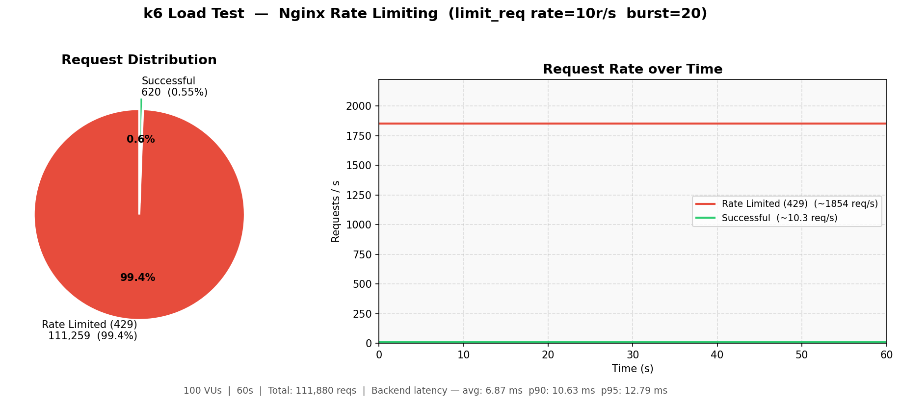
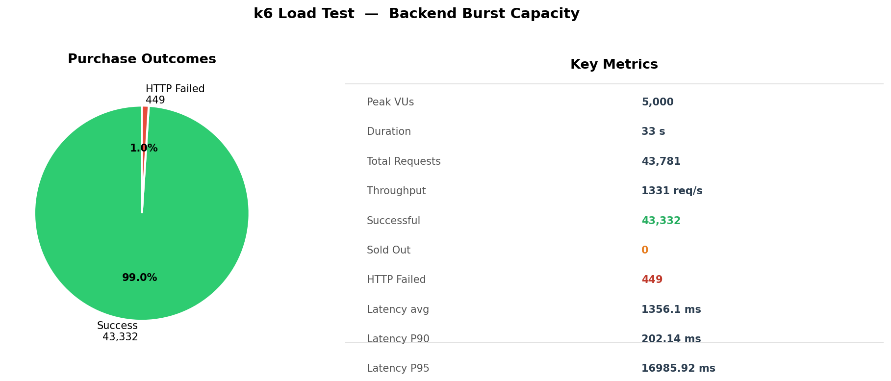
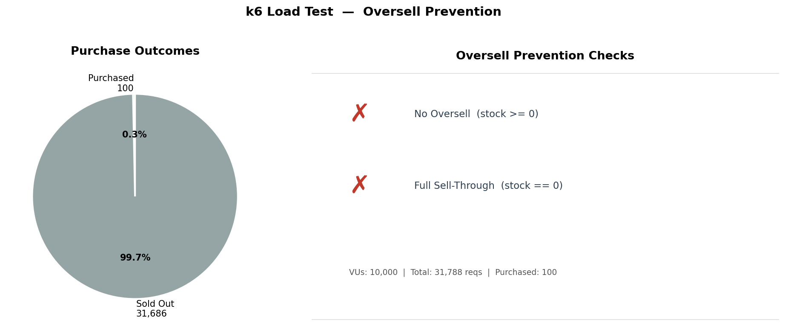

## k6 測試工具

k6 是一個現代化的負載測試（Load Testing）工具，主要用來模擬大量使用者同時存取系統，幫助找出效能瓶頸。

### 核心用途

可以用 k6 來測試:

- API 是否能承受高併發
- 網站在大量流量下會不會變慢或掛掉
- 系統的最大吞吐量（TPS / QPS）
- latency（回應時間）表現

### 為何用 k6

用 JavaScript 寫測試，且不用 GUI，直接用 code 控制測試流程

```
import http from 'k6/http';

export default function () {
  http.get('https://example.com');
}
```

高效能（用 Go 寫的）

- k6 本身是用 Go 寫的
- 可以輕鬆模擬數萬甚至數十萬 users

CLI + 自動化友善

- CI/CD（GitHub Actions / GitLab CI）
- 壓測 pipeline
- 部署驗證

### 核心概念

VUs（Virtual Users）: 虛擬使用者數量

```
export const options = {
  vus: 10,        // 同時 10 個人
  duration: '30s' // 持續 30 秒
};
```

iteration

- 每個 user 執行一次 script = 1 iteration

scenario: 控制流量模型

- 漸進加壓（ramp up）
- 突發流量（spike）
- 穩定流量（constant）

metrics（結果指標）

- `http_req_duration`: 回應時間
- `http_reqs`: 請求數
- `errors`: 錯誤率

### 簡單範例 (壓測 API)

```
import http from 'k6/http';
import { sleep } from 'k6';

export const options = {
  vus: 100,
  duration: '10s',
};

export default function () {
  http.get('https://api.example.com/data');
  sleep(1);
}
```

代表:

- 100 個人
- 每人每秒打一個 request
- 持續 10 秒

---

## 本專案的 k6 測試架構

### 腳本位置

```
scripts/k6/
├── buy_flow.js                         # 共用模組：請求邏輯、業務指標
├── test_nginx_rate_limit.js            # 驗證 Nginx 限流是否有效
├── test_backend_capacity.js            # 後端極限（瞬間 spike）
├── test_backend_ramp_to_breakpoint.js  # 逐步加壓找拐點
└── test_oversell.js                    # 防超賣驗證：高並發搶少票，確認庫存不為負
```

### 共用模組：buy_flow.js

所有測試腳本都從 `buy_flow.js` 引入請求邏輯，避免重複。

**匯出的指標**

| 指標名稱                 | 類型    | 說明                                             |
| ------------------------ | ------- | ------------------------------------------------ |
| `rate_limited_responses` | Counter | 被 Nginx 回傳 429 的次數                         |
| `purchase_success_rate`  | Rate    | 業務成功率（HTTP 200 + body.status==='success'） |
| `purchase_sold_out_rate` | Rate    | 售罄率（HTTP 200 + body.status==='fail'）        |

**為什麼需要業務指標？**

此系統的 API 對「搶票成功」和「已售罄」都回傳 HTTP 200，只有 body 裡的 `status` 欄位才有真正的結果。
若只看 `http_req_failed`，在庫存耗盡後所有請求仍然「成功」，無法反映真實壓測意義。

**user_id 設計**

每次請求的 `user_id` 使用 `vu{VU編號}_iter{Iteration編號}` 組成，確保身份唯一，符合真實場景。

### 測試前重置庫存（setup）

本系統庫存由 Redis 維護，服務啟動時初始化為 10 張。壓測時若不重置，庫存耗盡後所有請求都走「已售罄」的 early return 路徑，無法真正壓到業務邏輯。

各腳本的 `setup()` 會呼叫 `/admin/reset?stock=N` 重置庫存：

```javascript
export function setup() {
  const initialStock = parseInt(__ENV.INITIAL_STOCK || "1000000");
  resetStock(initialStock);
  return { initialStock };
}
```

預設值：

- `test_backend_capacity.js`：1,000,000
- `test_backend_ramp_to_breakpoint.js`：10,000,000
- `test_nginx_rate_limit.js`：100,000

可透過環境變數 `INITIAL_STOCK` 覆寫。

### 測試後驗證超賣（teardown）

`test_backend_capacity.js` 和 `test_backend_ramp_to_breakpoint.js` 在 `teardown()` 會查詢 `/stock` 並驗證剩餘庫存 >= 0，確保 Lua 原子性防超賣機制正確運作。

---

## 各測試腳本說明

### test_nginx_rate_limit.js

**目的：確認 Nginx `limit_req` 機制有效觸發 429**

- **VU 數**：100，持續 60s，直連 Nginx（port 80）
- **注意**：k6 container 內所有 VU 共用同一來源 IP，Nginx per-IP rate limit 是對全部 VU 共享的（非每 VU 各享 10 r/s）

**Thresholds**

| 門檻 | 說明 |
| --- | --- |
| `checks rate > 0.95` | 所有回應必須是 200 或 429，不允許 5xx 或逾時 |
| `rate_limited_responses count > 0` | 限流機制必須確實觸發 |
| `purchase_success_rate rate > 0` | 後端仍存活，有請求通過限流並成功 |
| `purchase_success_rate rate < 0.20` | 限流確實壓制成功率在 20% 以下 |

**結果圖示**



- **左圖（Pie）**：99.45% 的請求被 Nginx 攔截（429），僅 0.55% 成功通過。Nginx 設定 `rate=10r/s`，60 秒理論上限約 600 次，實測 620 次完全吻合。
- **右圖（Lines）**：兩條線幾乎重疊，紅線（被限流）貼頂、綠線（成功）貼底，兩者落差即為 Nginx 10 req/s 限制的視覺化呈現。藍色虛線標示 Nginx 設定的 10 req/s 上限。

---

### test_backend_capacity.js

**目的：在瞬間暴衝流量下，確認後端 HTTP 層的穩定性與最大吞吐**

- **流量形狀**：0 → 5,000 VUs（2 秒暴衝）→ 3,000 → 1,000 → 500 → 200 → 0
- **庫存**：1,000,000（確保測試期間不因售罄而走 early return）
- **Thresholds**：`checks > 95%`、`purchase_success_rate > 80%`

**結果圖示**



- **左圖（Bar）**：三種請求結果的數量分佈。
  - **Successful Purchase**（綠）：HTTP 200 且 status=success，成功購票
  - **Sold Out**（橘）：HTTP 200 且 status=fail，庫存耗盡的售罄回應
  - **HTTP Failed**（紅）：connection refused / connection reset，後端在 5,000 VU 峰值時被打超過承載上限，OS 層 TCP accept queue 溢出造成的連線中斷——這是預期行為，代表測試確實打到極限
- **右圖（Stats）**：關鍵數字，包含 peak VUs、吞吐量與後端延遲分佈

---

### test_backend_ramp_to_breakpoint.js

**目的：逐步加壓，找出「幾乎全成功」到「開始出現錯誤」的拐點 VU 數**

- **流量形狀**：15 → 30 → 60 → 120 → 250 → 500 → 1,000 → 2,000 → 3,500 VUs，每階段 30s
- **自動中止**：`http_req_failed > 3%` 或 `purchase_success_rate < 97%` 持續 20s 後自動停止，停止當下的 VU 數即為拐點

**結果圖示**


- **左圖（Bar）**：拐點當下三種結果的分佈。HTTP Failed 開始出現代表後端已達瓶頸，失敗率（括號內 %）即為觸發中止的指標。
- **右圖（Stats）**：`Peak VUs` 即為系統拐點，超過此數後錯誤率快速上升；延遲數字反映拐點當下的 P90 / P95。

---

### test_oversell.js

**目的：驗證高並發下不發生超賣，且票券能被正確售完**

- **情境**：10,000 VU 同時搶 100 張票，絕大多數請求預期收到售罄回應
- **Thresholds**：`checks == 100%`、`purchase_sold_out_rate > 99%`
- **teardown 驗證**：查詢 `/stock`，剩餘庫存必須恰好為 0
  - `remaining > 0` → race condition，部分票無法售出
  - `remaining < 0` → 超賣（oversell）
  - `remaining == 0` → 正確

**結果圖示**



- **左圖（Checks）**：teardown 驗證結果。✓ 代表通過，✗ 代表失敗。
  - **No Oversell**：剩餘庫存 ≥ 0，Lua 原子性腳本確保沒有超賣
  - **Full Sell-Through**：剩餘庫存 = 0，所有票券被正確售出，無 race condition 造成的漏賣
- **右圖（Bar）**：10,000 VU 中只有約 100 次（初始庫存數）成功購票，其餘全部售罄，比例符合預期。

---

## 視覺化工具

每支腳本執行完後都可以自動生成對應的結果圖。

### 執行方式

```bash
bash scripts/run_k6_and_plot.sh nginx
bash scripts/run_k6_and_plot.sh backend
bash scripts/run_k6_and_plot.sh breakpoint
bash scripts/run_k6_and_plot.sh oversell
```

一個指令完成：跑 k6 → 寫出 `k6_summary.json` → 在 Docker 內用 Python 畫圖 → 存成 PNG。

### 輸出檔案

| 指令參數     | 輸出檔案                   |
| ------------ | -------------------------- |
| `nginx`      | `k6_nginx_result.png`      |
| `backend`    | `k6_backend_result.png`    |
| `breakpoint` | `k6_breakpoint_result.png` |
| `oversell`   | `k6_oversell_result.png`   |

### 運作流程

```
run_k6_and_plot.sh
  ├─▶ docker compose run k6
  │       └─▶ handleSummary() 寫出 k6_summary.json
  └─▶ docker compose run plotter
          └─▶ 讀 k6_summary.json → 畫圖 → 存 PNG
```

---

## 環境變數

| 變數               | 預設值     | 說明                 |
| ------------------ | ---------- | -------------------- |
| `BASE_URL`         | 依腳本不同 | 覆寫目標 URL         |
| `BUY_HTTP_TIMEOUT` | `60s`      | 單次請求逾時時間     |
| `INITIAL_STOCK`    | 依腳本不同 | 壓測前重置的庫存數量 |

## 搭配 Prometheus Remote Write

k6 可將指標即時推送至 Prometheus，再用 Grafana 視覺化：

```bash
k6 run --out experimental-prometheus-rw \
       -e K6_PROMETHEUS_RW_SERVER_URL=http://prometheus:9090/api/v1/write \
       scripts/k6/test_backend_ramp_to_breakpoint.js
```

在 Grafana 中觀察的關鍵指標：

- `rate(k6_http_reqs[10s])` — 即時 RPS
- `rate(k6_http_req_failed[10s])` — 即時失敗率
- `k6_http_req_duration{quantile="0.95"}` — P95 延遲
- `k6_purchase_success_rate` — 業務層搶票成功率
