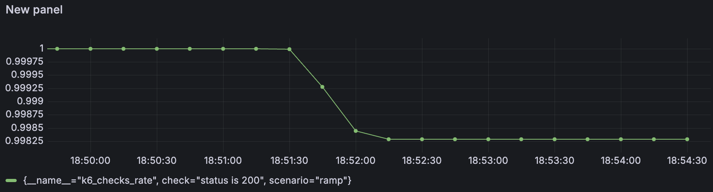
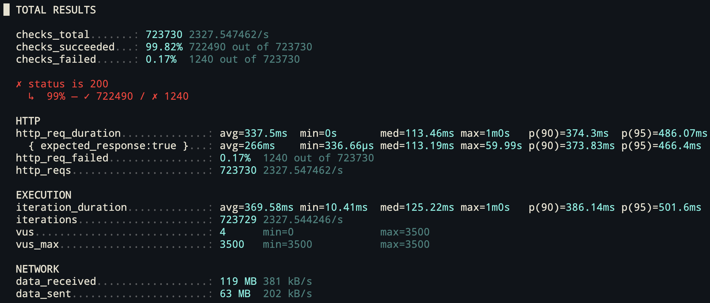

## 測試結果

| VUs  | Time(s) | checks_succeeded(%) |
| :--: | :-----: | :-----------------: |
|  15  |   30    |         100         |
|  30  |   30    |         100         |
|  60  |   30    |         100         |
| 120  |   30    |         100         |
| 250  |   30    |         100         |
| 500  |   30    |         100         |
| 1000 |   30    |         100         |
| 2000 |   30    |         100         |
| 3500 |   30    |        99.85        |
|  0   |   30    |        99.80        |

## 錯誤類型

### request timeout

### dial: i/o timeout
